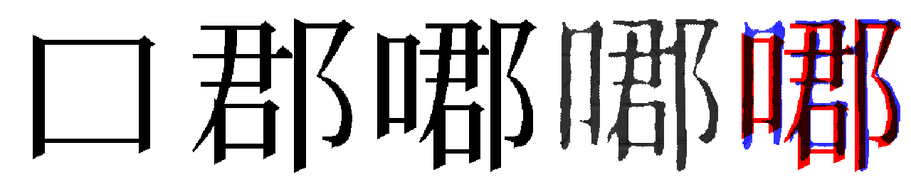

# AutoCJK

AutoCJK is a tool for generating low-resolution predictions of uncommon CJK
characters, given full-width images of their components.

Example:



(Left-to-right: (a) source left-hand component, (b) source right-hand component,
(c) expected composition, (d) predicted composition, (e) c/d difference)

### How do I generate a new character?

First install the project and its dependencies. See platform-specific instructions
on the [wiki](https://github.com/google/autocjk/wiki).

Given a font at `~/Downloads/font.otf`, we can render `⿰市來` and
write the generated image to `/tmp/out.png` with:

```
bazel run //src:main -- \
  --font_path=<path_to_font> \
  --input='⿰市來' \
  --out=/tmp/out.png
```

## Usage guide:

Bundled with this repo is `/src/generator.h5`, a trained model with pretty good
results. This generator was trained on ~270k image pairs, generated by
extracting characters from the fonts `NotoSansCJKsc-*` and `NotoSerifCJKsc-*`.

The resultant generator is pretty good at generating characters in that style.
It might even be pretty good at generating characters in a new style. If you
discover it's not, you can (a) generate a new batch of training images in your
own font style, and (b) run `model.py` in order to train a new model. If you
save that model as `src/generator.h5`, you can continue to use `bazel run //src:main` as expected.
